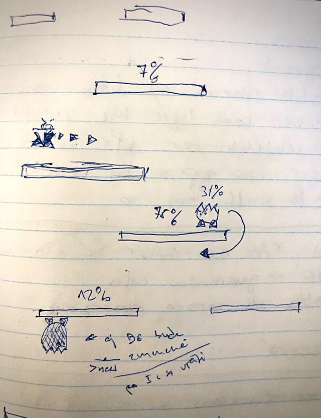
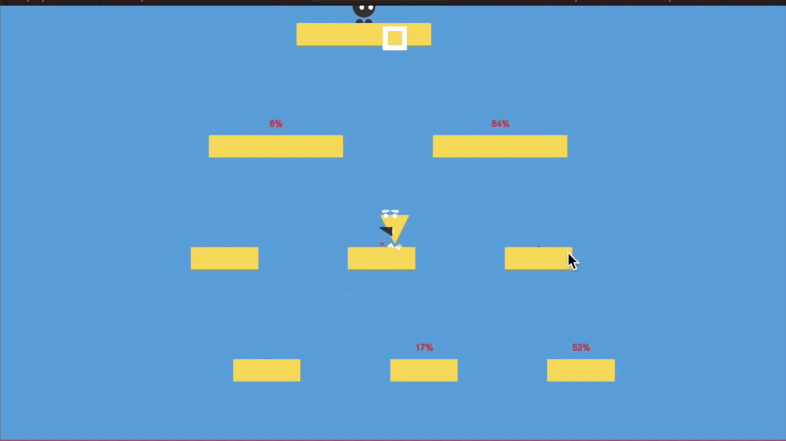
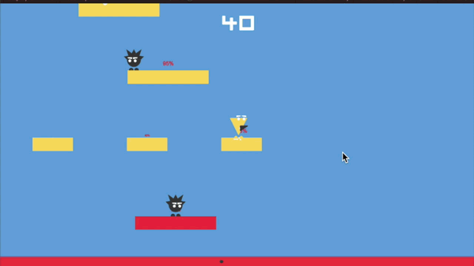
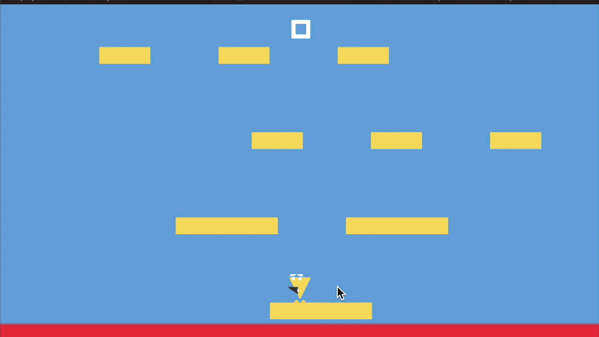
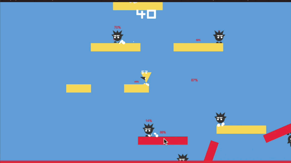

# Bugs Not Fixed

A simple pixel art arcade game made for [Wowie Jam 2.0!](https://itch.io/jam/wowie-jam-2).  
The topic is "intentional bugs" so there are a lot of bugs in the game 🙃  

The game can be played in the browser on [pixelook.itch.io/bugs-not-fixed](https://pixelook.itch.io/bugs-not-fixed).

## Used tools
[Affinity Designer](https://affinity.serif.com/en-gb/designer/) - for drawing  
[Bfxr](http://bfxr.net/), [ocenaudio](https://www.ocenaudio.com) - for SFX and sounds  
[ecrettmusic](http://ecrettmusic.com/)​- for the music  
[Unity3d](https://unity.com) - hmm...

## Pictures

### Cover

### Concept

### From game

